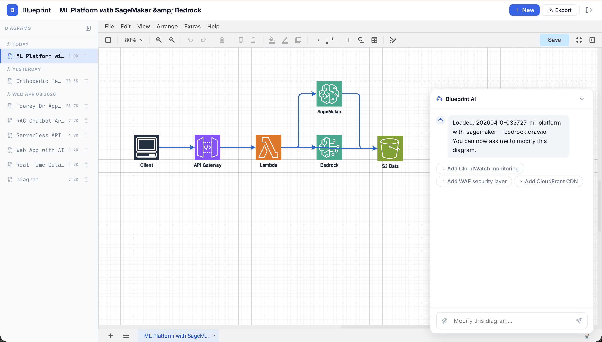
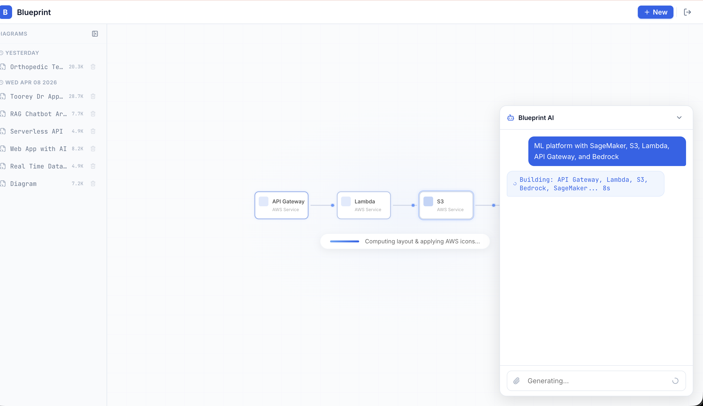

# Blueprint

AI-powered AWS architecture diagram generator. Describe an architecture in natural language, get an editable `.drawio` file with proper AWS icons. Refine through conversation.

```
You: "3-tier web app with ALB, ECS, RDS PostgreSQL, and ElastiCache"
Blueprint: [generates diagram in ~10s] → editable .drawio file

You: "Add CloudFront CDN in front of the ALB"
Blueprint: [patches diagram in ~5s] → updated .drawio file
```

## Screenshots

| Generate from natural language | Loading animation | Attach architecture docs |
|:---:|:---:|:---:|
|  |  |  |

## How It Works

Blueprint uses a **two-phase architecture** that separates what to draw (LLM) from how to draw it (renderer):

1. **LLM generates a compact JSON spec** (~400 tokens) describing nodes, edges, and clusters
2. **Deterministic renderer** maps AWS service types to draw.io icons, computes layout via Graphviz, and emits valid draw.io XML
3. **For edits**, the LLM generates a JSON patch (RFC 6902) instead of regenerating everything — ~5s vs ~30s

The LLM never touches draw.io XML. Style guide compliance (icon sizes, fonts, colors, container hierarchy) is enforced in code, not in the prompt.

## Architecture

```
┌─────────────┐     ┌──────────────┐     ┌─────────────────┐
│   Frontend   │────▶│  API Gateway  │────▶│     Lambda      │
│  React SPA   │     │  + JWT Auth   │     │  (Docker/arm64) │
└─────────────┘     └──────────────┘     └────────┬────────┘
                                                   │
                                          ┌────────▼────────┐
                                          │  Strands Agent   │
                                          │  Claude Haiku    │
                                          └────────┬────────┘
                                                   │
                              ┌─────────────┬──────┴──────┐
                              ▼             ▼              ▼
                        ┌──────────┐  ┌──────────┐  ┌──────────┐
                        │  Schema  │  │  Layout   │  │ Emitter  │
                        │  Parser  │  │ (Graphviz)│  │(draw.io) │
                        └──────────┘  └──────────┘  └──────────┘
                                                          │
                                                     ┌────▼────┐
                                                     │   S3    │
                                                     │ .drawio │
                                                     └─────────┘
```

## Project Structure

```
blueprint/
├── src/                          # Backend (Python)
│   ├── agent.py                  # Strands Agent — orchestrates LLM + tools
│   ├── prompts/
│   │   └── spec_system_prompt.py # System prompt — teaches LLM the JSON spec format
│   ├── renderer/
│   │   ├── schema.py             # JSON spec dataclasses + validation + normalization
│   │   ├── icons.py              # 80+ AWS service → draw.io mxgraph icon mapping
│   │   ├── layout.py             # Graphviz layout engine — computes coordinates
│   │   └── emitter.py            # Assembles draw.io XML from positioned nodes
│   └── tools/
│       ├── render_drawio.py      # @tool: render spec → draw.io XML → save to S3
│       ├── load_diagram.py       # @tool: load existing diagram + spec from S3
│       ├── save_diagram.py       # S3 save utility (used by Lambda handler)
│       └── validate_xml.py       # draw.io XML structural validator
├── frontend/                     # Frontend (React + TypeScript)
│   └── src/
│       ├── App.tsx               # Main app — sidebar, floating chat, diagram viewer
│       ├── DiagramSkeleton.tsx   # Loading animation — nodes appear with glow effects
│       ├── api.ts                # API client — async job polling, CRUD operations
│       ├── auth.ts               # Cognito PKCE OAuth2 flow
│       └── styles.ts             # Design system — colors, fonts, button styles
├── infra/                        # Infrastructure (CloudFormation + scripts)
│   ├── cfn/
│   │   ├── api.yaml              # IAM, Lambda, API Gateway, Cognito client
│   │   └── ecr.yaml              # ECR repository
│   ├── config/
│   │   ├── stg.env.example       # Staging config template
│   │   └── prd.env.example       # Production config template
│   ├── lambda/
│   │   ├── handler.py            # Lambda handler — async job pattern
│   │   └── Dockerfile            # Lambda Docker image (Python 3.13 + Graphviz)
│   ├── storage.yaml              # S3 bucket for diagram storage
│   ├── deploy.sh                 # Backend deploy: CFN + Docker + Lambda
│   └── deploy-frontend.sh        # Frontend deploy: build + S3 sync + CloudFront invalidation
└── tests/
    └── test_validate_xml.py      # XML validator tests
```

## Quick Start

### Prerequisites

- Python 3.13+
- Node.js 18+
- [Graphviz](https://graphviz.org/download/) installed (`brew install graphviz` on macOS)
- AWS account with Bedrock model access (Claude Haiku 4.5)
- AWS CLI configured with SSO or credentials
- Cognito User Pool (for authentication)

### Local Development

```bash
# Backend
python -m venv .venv
source .venv/bin/activate
pip install -r requirements.txt

# Test the renderer (no AWS needed)
python -c "
from src.renderer.schema import parse_spec, normalize_spec
from src.renderer.layout import compute_layout
from src.renderer.emitter import emit_drawio

spec = parse_spec({
    'title': 'Test',
    'nodes': {'alb': {'type': 'alb', 'label': 'ALB'}, 'svc': {'type': 'lambda', 'label': 'API'}},
    'edges': {'e1': {'source': 'alb', 'target': 'svc'}},
    'clusters': {}
})
spec = normalize_spec(spec)
layout = compute_layout(spec)
xml = emit_drawio(spec, layout)
with open('test.drawio', 'w') as f: f.write(xml)
print('Open test.drawio in draw.io')
"

# Test with LLM (requires AWS credentials + Bedrock access)
AWS_PROFILE=your-profile python src/agent.py "Serverless API with Lambda and DynamoDB"

# Frontend
cd frontend
npm install
cp .env.example .env  # Edit with your API endpoint + Cognito config
npm run dev
```

### Deploy to AWS

```bash
# 1. Create config
cp infra/config/stg.env.example infra/config/stg.env
# Edit stg.env with your Cognito pool ID, domain, frontend URL

# 2. Deploy backend (S3 + ECR + Lambda + API Gateway + Cognito)
./infra/deploy.sh stg your-aws-profile us-east-1

# 3. Deploy frontend
./infra/deploy-frontend.sh stg your-aws-profile us-east-1
```

## Key Design Decisions

### Why JSON spec + renderer instead of LLM-generated XML?

| Approach | Tokens | Time | Reliability |
|----------|--------|------|-------------|
| LLM generates draw.io XML | ~4000 | ~3 min | Fragile (malformed XML) |
| LLM generates JSON spec | ~400 | ~10s | Deterministic renderer |
| LLM generates JSON patch | ~60 | ~5s | Incremental edits |

The renderer enforces the style guide in code — icon sizes, fonts, colors, container hierarchy are never LLM-dependent.

### Why Haiku instead of Sonnet?

The JSON spec format is structured enough that Haiku handles it perfectly. Patches are trivial (3-line JSON). Haiku is 3-5x faster for this use case.

### Supported AWS Services

80+ services mapped to draw.io icons. See [`src/renderer/icons.py`](src/renderer/icons.py) for the full list. Includes: EC2, Lambda, ECS, EKS, Fargate, S3, RDS, DynamoDB, Aurora, ElastiCache, CloudFront, ALB, NLB, API Gateway, Route 53, Cognito, WAF, IAM, KMS, SQS, SNS, EventBridge, Step Functions, CloudWatch, Bedrock, SageMaker, Kinesis, Athena, Glue, and more.

## License

MIT
