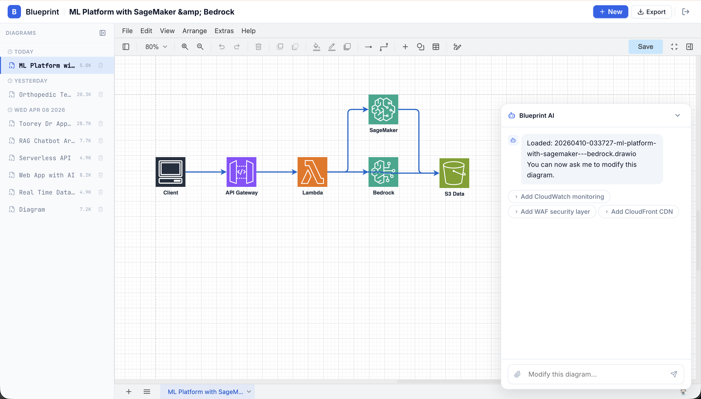
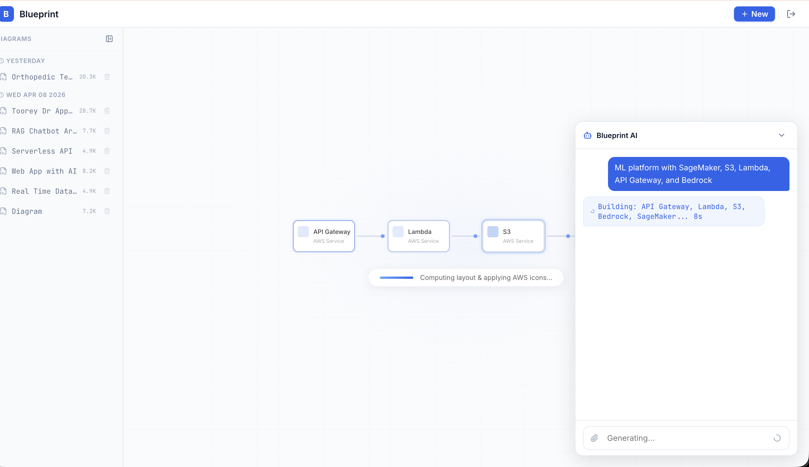
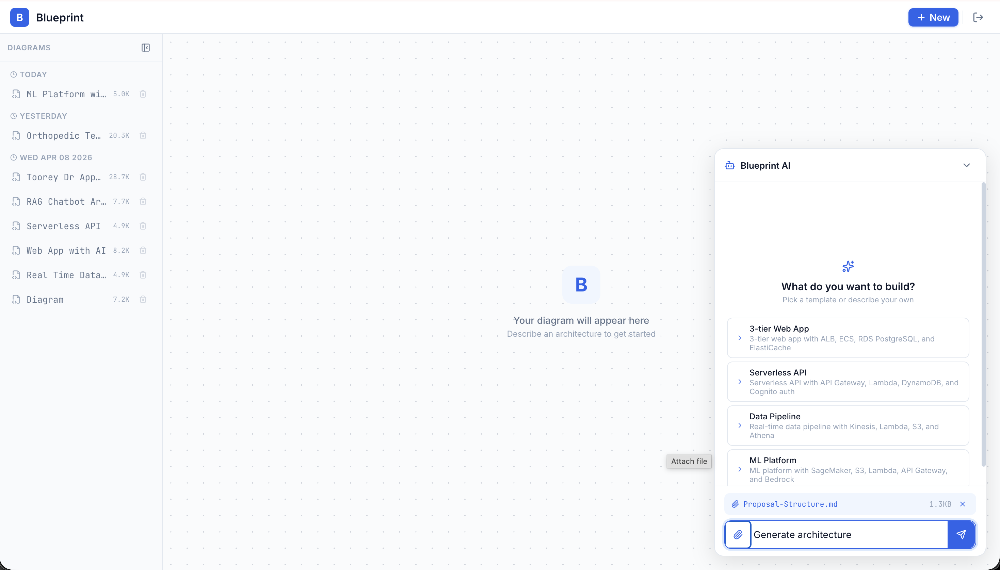

# Blueprint

AI-powered AWS architecture diagram generator. Describe an architecture in natural language, get an editable `.drawio` file with proper AWS icons. Refine through conversation.

**→ Try it free: [blueprint.theinfinitra.com](https://blueprint.theinfinitra.com)**

```
You: "3-tier web app with ALB, ECS, RDS PostgreSQL, and ElastiCache"
Blueprint: [generates diagram in ~10s] → editable .drawio file

You: "Add CloudFront CDN in front of the ALB"
Blueprint: [patches diagram in ~5s] → updated .drawio file
```

## Screenshots

|       Generate from natural language       |            Loading animation             |             Attach architecture docs             |
| :----------------------------------------: | :--------------------------------------: | :----------------------------------------------: |
|  |  |  |

## Features

- **Natural language → diagram** — describe what you want, get a `.drawio` file
- **Conversational edits** — refine via chat, edits take ~5s via JSON patches
- **178 AWS service icons** — official `mxgraph.aws4` stencil library with verified icon catalog
- **Deterministic rendering** — style guide enforced in code, not in the prompt
- **Editable output** — open in draw.io, export to PNG/SVG/PDF
- **Smart layout** — Graphviz-powered with source/sink rank pinning and auxiliary node placement
- **Error-safe icons** — broken stencil blocklist with automatic fallbacks
- **User-scoped storage** — each user's diagrams are isolated
- **Freemium** — 5 diagrams/month free, unlimited edits

## How It Works

Blueprint uses a **two-phase architecture** that separates what to draw (LLM) from how to draw it (renderer):

1. **LLM generates a compact JSON spec** (~400 tokens) describing nodes, edges, and clusters
2. **Deterministic renderer** maps AWS service types to draw.io icons, computes layout via Graphviz, and emits valid draw.io XML
3. **For edits**, the LLM generates a JSON patch (RFC 6902) instead of regenerating everything — ~5s vs ~30s

The LLM never touches draw.io XML. Style guide compliance (icon sizes, fonts, colors, container hierarchy) is enforced in code, not in the prompt.

## Architecture

```
blueprint.theinfinitra.com ──► CloudFront ──► S3 (React SPA)
                                                    │
                                              API Gateway (JWT)
                                                    │
                                              Lambda (Docker/arm64)
                                                    │
                                              Strands Agent
                                              (Claude Haiku)
                                                    │
                              ┌─────────────┬───────┴──────┐
                              ▼             ▼              ▼
                        ┌──────────┐  ┌──────────┐  ┌──────────┐
                        │  Schema  │  │  Layout   │  │ Emitter  │
                        │  Parser  │  │ (Graphviz)│  │(draw.io) │
                        └──────────┘  └──────────┘  └──────────┘
                                                          │
                                                     ┌────▼────┐
                                                     │   S3    │
                                                     │ .drawio │
                                                     └─────────┘
```

## Project Structure

```
blueprint/
├── src/                          # Backend (Python)
│   ├── agent.py                  # Strands Agent — orchestrates LLM + tools
│   ├── prompts/
│   │   └── spec_system_prompt.py # System prompt — JSON spec format + rules
│   ├── renderer/
│   │   ├── schema.py             # JSON spec dataclasses + validation + normalization
│   │   ├── icons.py              # 178 AWS service → draw.io icon mapping + blocklist
│   │   ├── layout.py             # Graphviz layout with rank pinning + auxiliary nodes
│   │   └── emitter.py            # draw.io XML with background rect, dynamic canvas, edge labels
│   └── tools/
│       ├── render_drawio.py      # @tool: render spec → draw.io XML → save to S3
│       ├── load_diagram.py       # @tool: load existing diagram + spec from S3
│       └── validate_xml.py       # draw.io XML structural validator
├── frontend/                     # Frontend (React + TypeScript)
│   └── src/
│       ├── App.tsx               # Landing page, chat UI, diagram viewer
│       ├── DiagramSkeleton.tsx   # Loading animation
│       ├── api.ts                # API client — async job polling, CRUD, usage
│       ├── auth.ts               # Cognito PKCE OAuth2 flow
│       └── styles.ts             # Design system — JetBrains Mono + Inter + Caveat
├── infra/                        # Infrastructure (CloudFormation)
│   ├── cfn/
│   │   ├── api.yaml              # Internal API Gateway + Lambda + Cognito client
│   │   ├── api-public.yaml       # Public API Gateway + DynamoDB usage table
│   │   ├── cognito-public.yaml   # Public Cognito pool + LinkedIn OIDC IdP
│   │   ├── frontend-public.yaml  # CloudFront + S3 for blueprint.theinfinitra.com
│   │   └── ecr.yaml              # ECR repository
│   ├── lambda/
│   │   ├── handler.py            # Lambda handler — async jobs, usage tracking, user scoping
│   │   └── Dockerfile            # Lambda Docker image (Python 3.13 + Graphviz)
│   ├── deploy.sh                 # Backend deploy
│   ├── deploy-public.sh          # Full public stack deploy
│   └── deploy-public-frontend.sh # Frontend-only deploy
└── tests/
    └── test_validate_xml.py      # XML validator tests
```

## Quick Start

### Prerequisites

- Python 3.13+
- Node.js 18+
- [Graphviz](https://graphviz.org/download/) (`brew install graphviz` on macOS)
- AWS account with Bedrock model access (Claude Haiku)
- AWS CLI configured

### Local Development

```bash
# Backend
python -m venv .venv
source .venv/bin/activate
pip install -r requirements.txt

# Test the renderer (no AWS needed)
python -c "
from src.renderer.schema import parse_spec, normalize_spec
from src.renderer.layout import compute_layout
from src.renderer.emitter import emit_drawio

spec = parse_spec({
    'title': 'Test',
    'nodes': {'alb': {'type': 'alb', 'label': 'ALB'}, 'svc': {'type': 'lambda', 'label': 'API'}},
    'edges': {'e1': {'source': 'alb', 'target': 'svc'}},
    'clusters': {}
})
spec = normalize_spec(spec)
layout = compute_layout(spec)
xml = emit_drawio(spec, layout)
with open('test.drawio', 'w') as f: f.write(xml)
print('Open test.drawio in draw.io')
"

# Frontend
cd frontend
npm install
cp .env.example .env  # Edit with your API endpoint + Cognito config
npm run dev
```

## Supported AWS Services (178 icons)

| Category | Services |
|----------|----------|
| Compute | Lambda, EC2, ECS, EKS, Fargate, Batch, App Runner, Auto Scaling |
| Networking | CloudFront, Route 53, ALB, NLB, API Gateway, VPC Lattice, Transit Gateway, Internet Gateway, NAT Gateway, VPN Gateway |
| Database | RDS, Aurora, DynamoDB, ElastiCache, Redshift, Neptune, DocumentDB, Timestream, MemoryDB |
| Storage | S3, EFS, EBS, FSx, Glacier, Backup, Storage Gateway |
| Security | IAM, Cognito, KMS, WAF, Shield, GuardDuty, Inspector, Secrets Manager, Identity Center |
| Integration | SQS, SNS, EventBridge, Step Functions, AppSync, MQ, SES |
| Analytics | Kinesis, Athena, Glue, EMR, OpenSearch, QuickSight, MSK, Lake Formation |
| AI/ML | Bedrock, SageMaker, Comprehend, Rekognition, Textract, Polly, Lex, Kendra |
| Developer | CodePipeline, CodeBuild, CodeDeploy, X-Ray, CodeArtifact |
| IoT | IoT Core, IoT Greengrass, IoT Analytics, IoT Events |

## Key Design Decisions

### Why JSON spec + renderer instead of LLM-generated XML?

| Approach | Tokens | Time | Reliability |
|----------|--------|------|-------------|
| LLM generates draw.io XML | ~4000 | ~3 min | Fragile (malformed XML) |
| LLM generates JSON spec | ~400 | ~10s | Deterministic renderer |
| LLM generates JSON patch | ~60 | ~5s | Incremental edits |

### Icon Safety

- **Broken icons blocklist** — known-broken stencil names (e.g., `dynamodb_table`) are mapped to working alternatives
- **Safe fallback** — unknown service types render as `general_AWScloud` icon (always visible) instead of guessing stencil names
- **Legacy name mapping** — renamed services use their old stencil names (e.g., OpenSearch → `elasticsearch_service`)

### Layout

- Graphviz `dot` engine with adaptive spacing based on node count
- Source/sink rank pinning (frontends left, data stores right)
- Auxiliary nodes (monitoring, DLQ) pushed below main flow
- Dynamic canvas sizing based on graph dimensions
- PNG export background rectangle (prevents black background)

## Contributing

PRs welcome. Please:
1. Run `pytest tests/` before submitting
2. Add icons to `src/renderer/icons.py` (not the prompt)
3. Test with `python src/agent.py "your test prompt"` if changing the system prompt

## License

MIT
